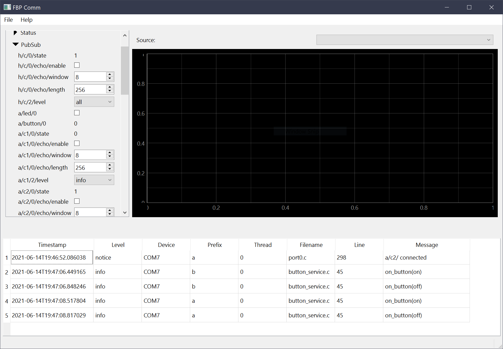

<!--
# Copyright 2014-2021 Jetperch LLC
#
# Licensed under the Apache License, Version 2.0 (the "License");
# you may not use this file except in compliance with the License.
# You may obtain a copy of the License at
#
#     http://www.apache.org/licenses/LICENSE-2.0
#
# Unless required by applicable law or agreed to in writing, software
# distributed under the License is distributed on an "AS IS" BASIS,
# WITHOUT WARRANTIES OR CONDITIONS OF ANY KIND, either express or implied.
# See the License for the specific language governing permissions and
# limitations under the License.
-->

# Welcome!

Welcome to Fitterbap, the **Fi**rmware **t**oolkit **t**o **e**nable 
**r**eliable **b**est **a**rchitecture **p**ractices!
Fitterbap provides common utilities useful for embedded systems that are often 
not included in an RTOS or the standard C library.  Fitterbap includes:

* A distributed publish-subscribe implementation for easy command, control,
  and configuration of your designs.
* A high-reliability data link protocol, suitable for UARTs.
* Common C macros, including assert and design-by-contract.
* Host software and UI to accelerate firmware development.
* And more!

This library is intended for use by software developers producing 
firmware for embedded devices based upon microcontrollers.  Many features of
the library use malloc, but it avoids using free.
The Fitterbap library is available under the permissive Apache 2.0 license.

As of June 2021, the Fitterbap library API is not yet stable and subject to 
change without notice.

## Getting started

The easiest way to get started is to check out the
[fitterbap_example_stm32g4](https://github.com/jetperch/fitterbap_example_stm32g4).
If you want to try distributed PubSub and the comm stack, you can buy the 
[STMicroelectronics Nucleo-G491RE](https://www.st.com/en/evaluation-tools/nucleo-g491re.html)
development board.  When you first connect the Nucleo board over USB, 
it shows up as a mass storage device.  You can simply copy over the 
release binaries and start the host UI, which looks like this:

## Known limitations

*   Comm
    *    No native USB reference implementation yet, but can use USB-CDC.
*   PubSub
    *    Hard-coded maximum topic lengths.
    *    No validation using provided topic metadata.
*   Host
    *    Win 10x64 only, no macOS or Linux yet.
    *    fbp_fatal not properly implemented for pyfitterbap.

## Installation

The Fitterbap library uses CMake to generate the project make files for 
the C components.

Since Fitterbap is a library primarily targeted at embedded microcontrollers, 
you will likely want to include compile it into your project.  Projects
using CMake can use ExternalProject_Add.  Other build systems
will likely need to include the source files directly.  Consider using
git subtrees or git submodules.  

You will need to manually create the fitterbap/config.h file and implement the
platform abstraction layer.   See fitterbap/platform.h for details.

### Host python

Install 64-bit python 3.8 or newer on your system.  Confirm that it is correctly installed:

    python3 -VV

On Windows, python 3 is usually installed as `python` rather than `python3`.

Then install the pyfitterbap package from pypi:

    pip install -U pyfitterbap

You can then run the pyfitterbap communication UI tools using either:

    python3 -m pyfitterbap comm_ui

Or

    fitterbap comm_ui
    

### Ubuntu

First install the build tools for your system.

    sudo apt-get install build-essential cmake doxygen graphviz git

Then compile the Fitterbap library:

    cd PROJECT_DIRECTORY
    mkdir build && cd $_
    cmake ..
    cmake --build .
    ctest .

You can also build and test the python library:

    python3 setup.py build_ext --inplace
    python3 -m unittest

To run the host comm UI:

    python3 -m pyfitterbap comm_ui

## Licenses

The Fitterbap library is available under the permissive Apache 2.0 license.
This library includes all third-party dependencies in the third-party
directory.  The dependencies are built along with this project.  
These third-party libraries are provided under their own 
[licenses](third-party/README.md).

## More information

The Fitterbap API is documented using doxygen.

For a history of changes, see the [changelog](CHANGELOG.md).

## Alternatives

Fitterbap is a broad library that implements several distinct features.
Here are some other libraries that you can consider.

Full system:

*   [Pigweed](https://pigweed.dev/)
*   [MBEDDR](http://mbeddr.com/)
*   [Piconomic FW Library](https://github.com/piconomix/piconomix-fwlib)

Communication protocols:

*   [luos](https://www.luos.io/)
*   [Telemetry](https://github.com/Overdrivr/Telemetry)
*   [min](https://github.com/min-protocol/min)
*   [SerialFiller](https://github.com/gbmhunter/SerialFiller)
*   [Lasp](https://lasp-lang.readme.io/) - totally different scale
*   [Stream Control Transmission Protocol (SCTP)](https://tools.ietf.org/html/rfc4960)    
*   [Lab Streaming Layer](https://labstreaminglayer.readthedocs.io/info/intro.html)
    and [PlotJuggler](https://github.com/facontidavide/PlotJuggler)

PubSub:

*   [pubsub-c](https://github.com/jaracil/pubsub-c)

Command & control:

*   [microrl](https://github.com/Helius/microrl) - command line

Random number generation:

*   https://en.wikipedia.org/wiki/Xorshift
*   http://www.pcg-random.org/ 
*   [small](http://excamera.com/sphinx/article-xorshift.html)

String

*   [mpaland's printf](https://github.com/mpaland/printf)
